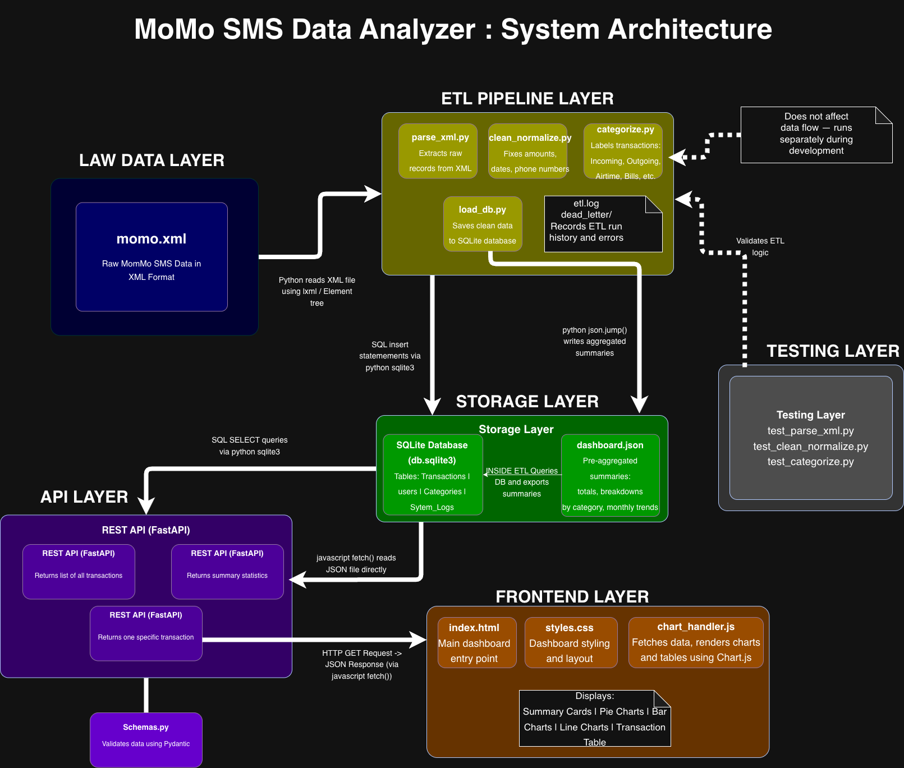

# MoMo SMS Data Analyzer

## Team Name
The GRID 

## Team Members
- Karega Uwase Ines  
- Kayumba Isaro Gania 
- Keza Rutayisire Alicia 
- Nshizirungu Wilson
- Teta Aline

## Project Description

### The Problem
MTN MoMo users receive hundreds of SMS messages for every transaction they make — sending money, paying bills, buying airtime, etc. These messages are stored in raw XML format, making it impossible to search, track, or understand your own financial activity.

### Our Solution
We are building a web application that:
- Reads and processes the raw MoMo XML SMS data
- Cleans and organizes every transaction
- Sorts transactions into categories (e.g., sent money, received money, airtime, bill payments)
- Stores everything in a database
- Shows the results on a visual dashboard with charts and tables

## System Architecture

## Scrum Board
https://github.com/users/Alicia-Keza/projects/1

## How to Run the Project
 To be  updated 

## AI Usage Log
We used Claude AI (by Anthropic) to help draft the initial README structure and project description. The content was reviewed, edited, and personalized by the whole team.
